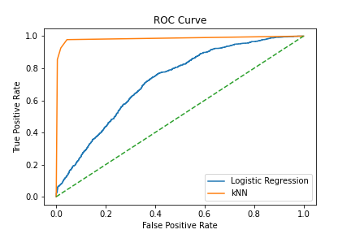

# Goal
Predicting whether a microorganism is Ulothrix (algae) or not among a data set of microorganisms and their features.

# Process
The data set consist of 30,000+ datapoints and 15 numerical features. The target consist of 30% "Ulothrix" and 70% "Other". The data is imbalanced and should be accounted for when modeling.

# Preliminary conclusions
Classification analysis using knn and Logistic regression. kNN perform better than Logistic Regression. kNN scored better in accuracy, precision, recall and F1 score. Figure 1 shows the ROC curve comparing both models

# Next steps
Perform tree based models and optimize Logistic Regression to improve overall performance by tuning parameters such as C.

# Results knn
Best params:  {'n_neighbors': 3}
Best estimator:  KNeighborsClassifier(n_neighbors=3)
Best score:  0.9780194344360738

The score (accuracy) for kNN is
Training without validation:  98.98%
Training with cross-validation:  95.28%
Test set:  96.81%

Default threshold:
Precision:  0.941
Recall:  0.926
F1:  0.933

# Results Logistic regression
C = 0.95, max_iter = 500

The score (accuracy) for Logistic Regression is
Training without validation:  77.55%
Training with cross-validation:  77.54%
Test set:  77.68%

Default threshold:
Precision:  0.293
Recall:  0.109
F1:  0.158

# Figure 1: ROC curve comparing models
